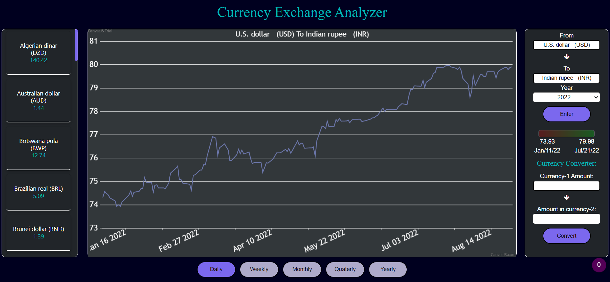

# Links

-   Github: <https://github.com/sahil1710/team_4_FX-Currency>

-   Hosted Site: <https://fx-currency-nt-t4.netlify.app/>

    ## About The Project

-   With the means of the acquired data, our team has designed a user
    friendly web-based application to analyse foreign exchange rates.
    -Our project displays a graph depicting currency exchange rates for
    the specified time periods, ranging daily, weekly, monthly,
    quarterly, and annually, based on the currencies the user has
    selected.

-   For the specified year, the corresponding currency conversions for
    entered amount will also be available.

-   The exchange rates for the specified year are also shown in a
    separate column.

## Techologies Used

-   Languages:
    1.  HTML
    2.  CSS
    3.  Javascript -Graph: Canvas.js -Layout: Bootstrap -File Types:
        JSON

## How To Use?

1.  For Graph Analysis

-   Enter Currency_1(default U.S. Dollar)
-   Enter Currency_2(default I.N. Rupee)
-   Press Enter
-   If you wish to get the data for a specific interval, select options
    available at the bottom of the chart.

1.  For Currency Amount Conversion

-   Enter Currency_Amount_1
-   Press Convert

1.  Hover over graph to see the data of that point
2.  Scroll to view all the currencies
3.  To change the currencies click on the current currency to be changed
    and select the new currency

## Requirement 

-   To run on computer:
    1.  Localhost
    2.  VS Code Live Server
-   Internet
